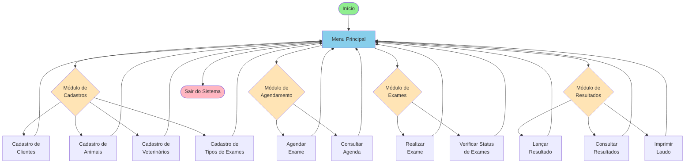
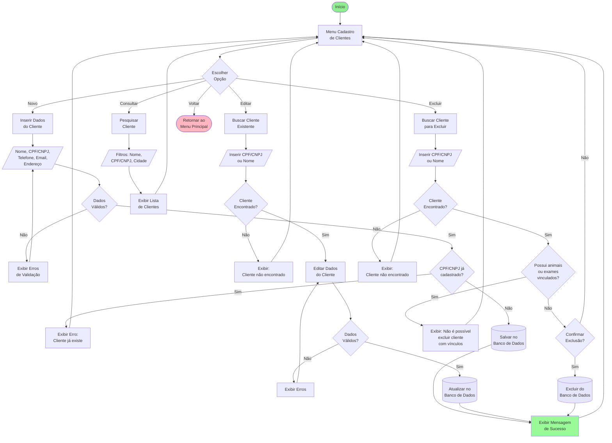
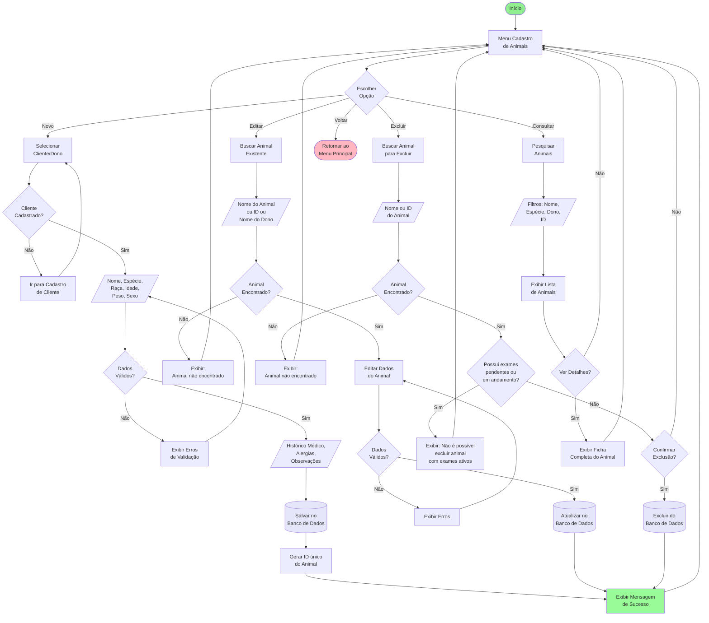
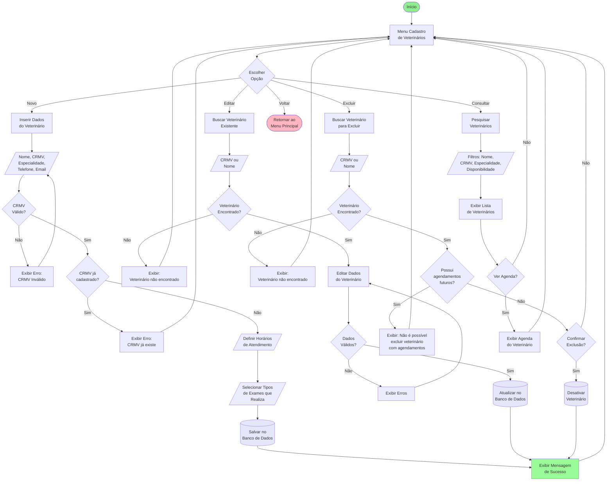
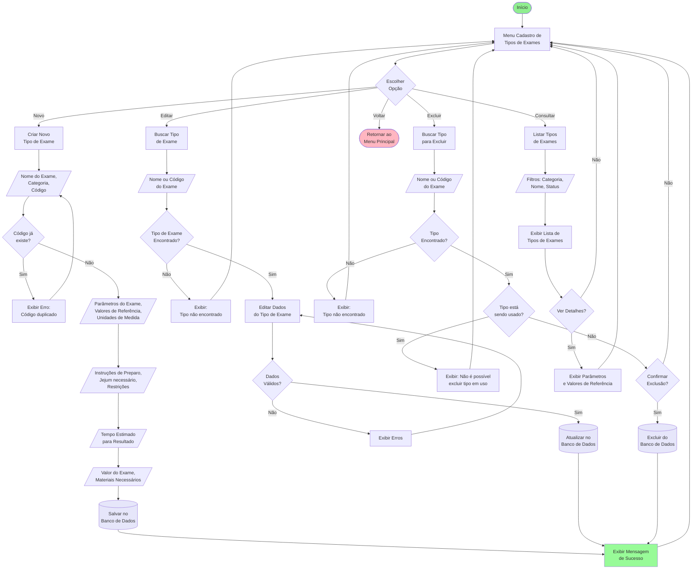
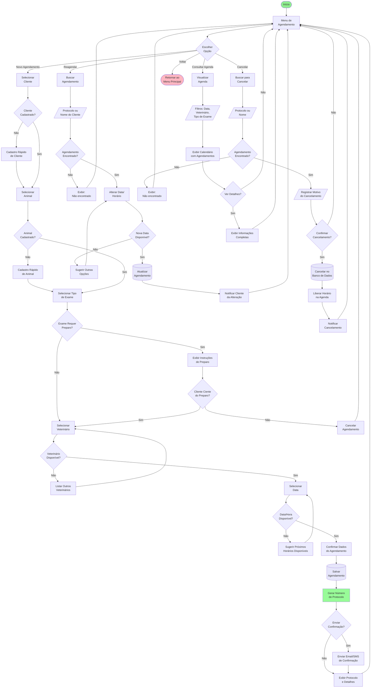
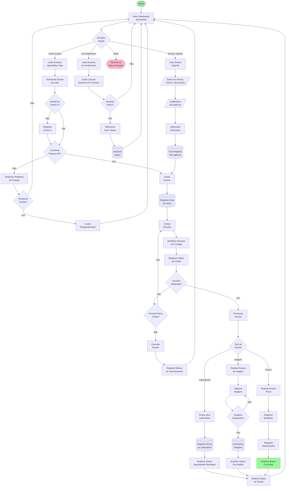
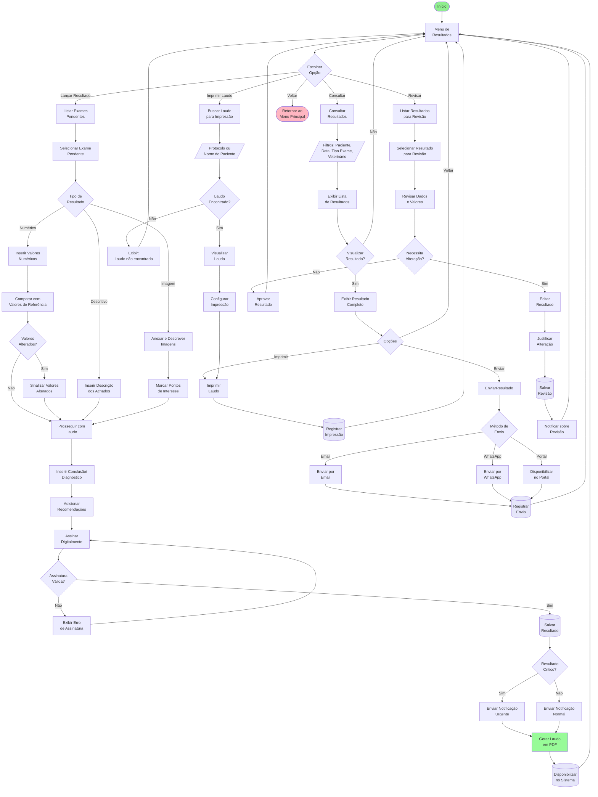

# Fluxogramas - Sistema de Gerenciamento de Exames Veterinários

## 1. Visão Geral do Sistema

## 2. Fluxograma Detalhado - Cadastro de Clientes

## 3. Fluxograma Detalhado - Cadastro de Animais

## 4. Fluxograma Detalhado - Cadastro de Veterinários

## 5. Fluxograma Detalhado - Cadastro de Tipos de Exames

## 6. Fluxograma Detalhado - Agendamento de Exames

## 7. Fluxograma Detalhado - Realização de Exames

## 8. Fluxograma Detalhado - Resultado de Exames

## Legendas

### Cores utilizadas:

- 🟢 **Verde claro** (#90EE90): Início do processo
- 🔴 **Rosa claro** (#FFB6C1): Fim do processo
- 🔵 **Azul claro** (#87CEEB): Menu principal
- 🟡 **Amarelo claro** (#FFE4B5): Módulos principais
- 🟣 **Lavanda** (#E6E6FA): Operações de banco de dados
- 🟢 **Verde menta** (#98FB98): Operações bem-sucedidas

### Símbolos:

- **Retângulo**: Processo/Ação
- **Losango**: Decisão
- **Retângulo arredondado**: Início/Fim
- **Paralelogramo** (/texto/): Entrada de dados
- **Cilindro** [(texto)]: Operação de banco de dados
